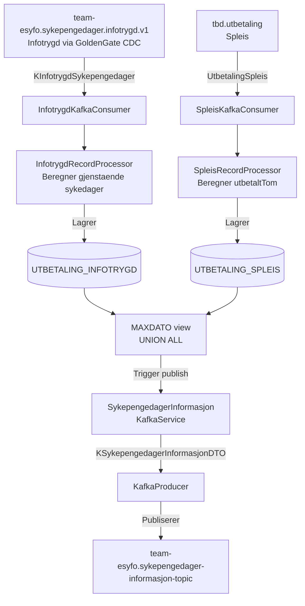
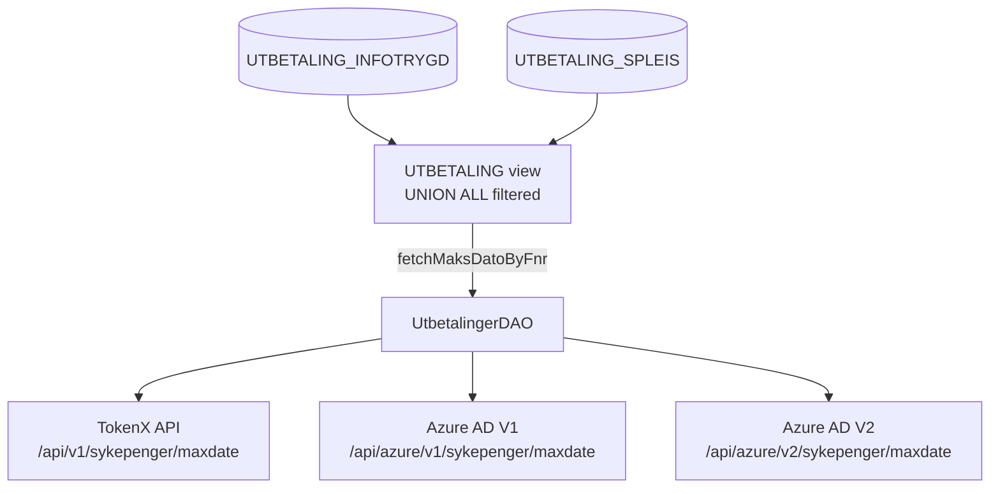

# Sykepengedager-informasjon app

[](https://github.com/navikt/sykepengedager-informasjon/actions/workflows/build-and-deploy.yaml)

[](https://kotlinlang.org/)
[](https://spring.io/)
[](https://kafka.apache.org/)
[](https://www.postgresql.org/)
[](https://gradle.org/)

## Miljøer

[🚀 Produksjon](https://sykepengedager-informasjon.intern.nav.no)

[🛠️ Utvikling](https://sykepengedager-informasjon.intern.dev.nav.no)

## Formålet med appen

Appen har to hovedmål: aggregering og distribusjon av informasjon om sykepengedager fra ulike kilder, samt et REST-API for å hente maksdato og annen relevant informasjon.

### Aggregering og distribusjon av sykepengedagerinformasjon



**Konsumerer Kafka-topics**: Lytter på `team-esyfo.sykepengedager.infotrygd.v1` (data fra [Infotrygd via Oracle-database med GoldenGate CDC](#data-from-infotrygd---goldengate-cdc-change-data-capture)) og `tbd.utbetaling` (data fra Spleis). Ved mottak av meldinger lagres betalingsdata i PostgreSQL-databasen, og samtidig beregnes og publiseres maksdato, `gjenstaendeSykedager` og opprettelsesdato til `team-esyfo.sykepengedager-informasjon-topic`.

**Topic DTO**: Se [KSykepengedagerInformasjonDTO.kt](src/main/kotlin/no/nav/syfo/kafka/producers/domain/KSykepengedagerInformasjonDTO.kt) for detaljert informasjon om datastrukturen.

### REST API-endepunkter



#### Endepunkter

`GET /api/v1/sykepenger/maxdate` Returnerer maksdato-informasjon for sluttbruker. Autentisert med TokenX (Level4 eller idporten-loa-high).

`GET /api/azure/v1/sykepenger/maxdate` Returnerer maksdato for veileder i legacy format. Autentisert med Azure AD. Krever `Nav-Personident` og `Nav-Call-Id` headere.

`GET /api/azure/v2/sykepenger/maxdate` Returnerer full maksdato-respons for veileder med alle felter. Autentisert med Azure AD. Krever `Nav-Personident` og `Nav-Call-Id` headere.

## Data from Infotrygd - GoldenGate CDC (Change Data Capture)

Data fra Infotrygd flyter fra en Oracle-database via GoldenGate CDC til Kafkatopic `team-esyfo.sykepengedager.infotrygd.v1` ved hjelp av en AivenApplication-konfigurasjon. Anders Østby har vært involvert tidligere i dette, men han jobber ikke i vårt team lenger

Infotrygd er ikke i NAIS, så for at det skal kunne skrive til vårt topic, må vi gjøre følgende:
- Opprette en AivenApplication som beskrevet [her](https://docs.nais.io/persistence/kafka/how-to/access-from-non-nais/)
- Opprett et vanlig Kafka-topic.
- Hent de genererte credentials og del dem i en Jira-forespørsel til Infotrygd. Se [den tidligere Jira-forespørselen](https://jira.adeo.no/browse/PK-61174) for referanse.

Kommandoer for å opprette topic og hente credentials ("ASDF" og "XYZ" er DNS-labels definert for secret i NAIS aiven-config i [applikasjonen](https://github.com/navikt/sykepengedager-informasjon/blob/main/nais/aiven-sykepengedager-infotrygd-dev.yml)):

Utvikling
```bash
kubectl get secret aiven-sykepengedager-infotrygd-dev-XYZ -ojson | jq -r ".data[\"client.keystore.p12\"]" | base64 -d > ./infotrygd_secrets/sykepengedager-infotrygd-dev-keystore.p12

kubectl get secret aiven-sykepengedager-infotrygd-dev-XYZ -ojson | jq -r ".data[\"client.truststore.jks\"]" | base64 -d > ./infotrygd_secrets/sykepengedager-infotrygd-dev-truststore.jks
```

Produksjon
```shell
kubectl get secret aiven-sykepengedager-infotrygd-prod-ASDF -ojson | jq -r ".data[\"client.keystore.p12\"]" | base64 -d > ./infotrygd_secrets/sykepengedager-infotrygd-prod-keystore.p12

kubectl get secret aiven-sykepengedager-infotrygd-prod-ASDF -ojson | jq -r ".data[\"client.truststore.jks\"]" | base64 -d > ./infotrygd_secrets/sykepengedager-infotrygd-prod-truststore.jks
```

## Tilgang til topic `team-esyfo.sykepengedager-informasjon-topic`

For å få tilgang til `team-esyfo.sykepengedager-informasjon-topic`, kontakt team `#esyfo` på Slack for å legge til applikasjonen din med leserettigheter. Du må også legge til `sykepengedager-informasjon` i outbound-reglene i appen din.

## Utvikling (kjøre tester)

Kjør tester: `./gradlew test`

## Kontakt

For NAV medarbeider ta kontakt i vår Slackkanal `#esyfo`
